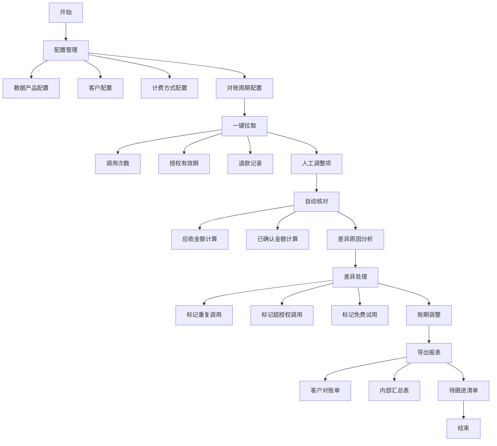

## 1. 产品概述

数据要素流通对账自动化工具，供平台运营人员在月末核对数据产品调用量和结算金额。通过自动化流程替代人工对账，提高效率，减少人工错误，确保数据交易结算的准确性。

- 主要目的：自动化完成数据产品调用量与结算金额的核对，处理差异，生成对账报表
- 解决问题：人工对账效率低、易出错、差异追踪困难
- 目标用户：平台运营人员、财务人员
- 市场价值：提升对账效率80%以上，确保数据交易结算的准确性和可追溯性

## 2. 核心功能

### 2.1 用户角色

| 角色 | 注册方式 | 核心权限 |
|------|----------|----------|
| 运营人员 | 系统账号登录 | 配置对账参数、执行对账、处理差异、导出报表 |
| 财务人员 | 系统账号登录 | 查看对账结果、导出财务报表 |

### 2.2 功能模块

1. **配置模块**：数据产品配置、客户配置、计费方式配置、对账周期配置
2. **拉取模块**：调用次数拉取、授权有效期拉取、退款记录拉取、人工调整项拉取
3. **核对模块**：应收金额计算、已确认金额计算、差异原因分析
4. **差异处理模块**：标记重复调用、标记超授权调用、标记免费试用、账期调整
5. **导出模块**：客户对账单导出、内部汇总表导出、待跟进清单导出

### 2.3 页面详情

| 页面名称 | 模块名称 | 功能描述 |
|---------|---------|----------|
| 首页/工作台 | 数据概览 | 展示对账进度、差异统计、快捷操作 |
| 配置管理 | 数据产品配置 | 增删改查数据产品信息、定价规则 |
| 配置管理 | 客户配置 | 增删改查客户信息、关联数据产品授权 |
| 配置管理 | 计费方式配置 | 配置按次、包月、阶梯定价等计费规则 |
| 配置管理 | 对账周期配置 | 设置对账周期、节假日排除规则 |
| 数据拉取 | 一键拉取 | 一键拉取各数据源数据、展示拉取状态 |
| 对账核对 | 对账列表 | 展示各客户对账结果、金额对比 |
| 对账核对 | 对账详情 | 展示详细调用明细、差异项展示 |
| 差异处理 | 差异列表 | 展示所有差异项、支持标记处理 |
| 差异处理 | 差异详情 | 处理单个差异项、记录处理备注 |
| 报表导出 | 导出中心 | 选择报表类型、导出范围、生成报表 |

## 3. 核心流程

运营人员登录系统 → 配置数据产品、客户、计费方式和对账周期 → 一键拉取调用次数、授权有效期、退款记录和人工调整项 → 系统自动核对生成应收金额、已确认金额和差异原因 → 运营人员标记差异处理(重复调用、超授权、免费试用、账期调整 → 导出客户对账单、内部汇总表和待跟进清单。

## 4. 用户界面设计

### 4.1 设计风格

- **主色调**：深海军蓝 (#0F172A) - 代表专业、可靠
- **辅助色**：翡翠绿 (#10B981) - 代表成功、准确
- **强调色**：琥珀橙 (#F59E0B) - 代表警告、待处理
- **危险色**：玫瑰红 (#F43F5E) - 代表错误、差异
- **中性色**：石板灰系列 (#F8FAFC 到 #0F172A)

- **按钮风格**：圆角矩形，4px圆角，悬停时有轻微阴影提升
- **字体**：
  - 标题："Noto Sans SC"，粗体
  - 正文："Noto Sans SC"，常规
  - 数字："JetBrains Mono"，等宽字体确保数字对齐
- **布局风格**：左侧导航 + 顶部标题栏 + 主内容区卡片式布局
- **图标风格**：Lucide 线性图标，统一16px/20px尺寸

### 4.2 页面设计概述

| 页面名称 | 模块名称 | UI元素 |
|---------|---------|--------|
| 工作台 | 数据概览 | 统计卡片、进度条、快捷操作按钮、最近对账列表 |
| 配置管理 | 数据产品配置 | 表格列表、新增/编辑弹窗、搜索筛选 |
| 配置管理 | 客户配置 | 表格列表、关联产品弹窗、状态标签 |
| 数据拉取 | 一键拉取 | 拉取状态时间线、数据源卡片、进度指示器 |
| 对账核对 | 对账列表 | 金额对比卡片、差异高亮、客户分组表格 |
| 差异处理 | 差异列表 | 差异类型标签、处理状态徽章、操作下拉菜单 |
| 报表导出 | 导出中心 | 报表类型选择器、日期范围选择器、导出按钮、历史记录 |

### 4.3 响应式

- 桌面端优先设计，支持1280px及以上宽度
- 平板端：左侧导航可折叠
- 移动端：底部导航栏，卡片垂直堆叠
- 表格支持水平滚动
- 触摸操作按钮最小44px高度便于点击

### 4.4 交互设计

- 页面加载时数字滚动动画
- 数据拉取进度条动画
- 金额差异数值高亮脉冲动画
- 按钮悬停轻微上浮效果
- 表格行悬停背景色变化
- 差异处理成功后平滑过渡
