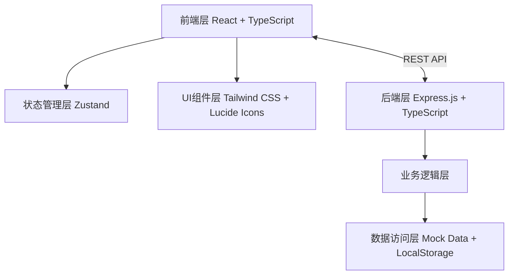
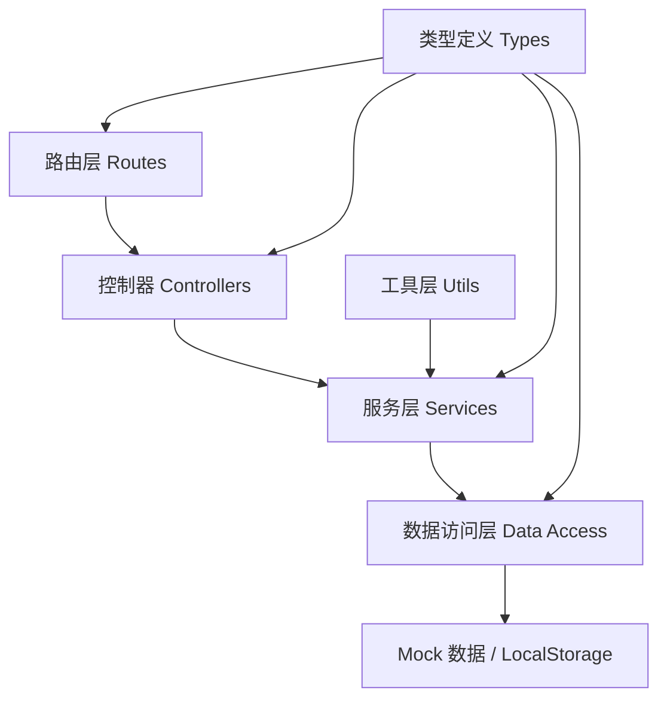
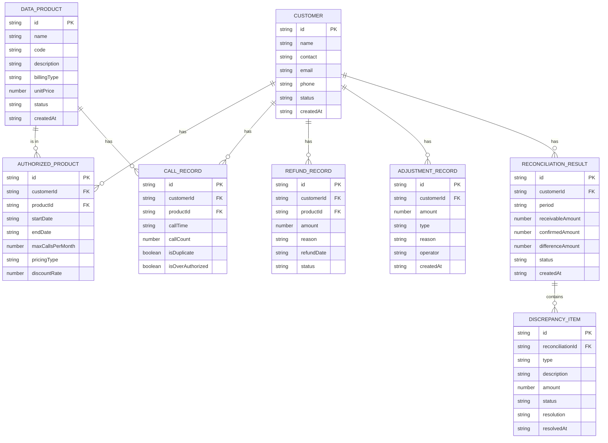

## 1. 架构设计



## 2. 技术描述

- 前端: React@18 + TypeScript + Vite + React Router DOM + Tailwind CSS@3 + Zustand
- 图标: lucide-react
- 后端: Express@4 + TypeScript
- 数据存储: LocalStorage (前端持久化) + Mock 数据 (演示用)
- 导出功能: xlsx库 (Excel导出)
- 初始化工具: vite-init

## 3. 路由定义

| 路由 | 页面 | 用途 |
|------|------|------|
| / | 工作台 | 对账进度概览、快捷操作 |
| /config/products | 数据产品配置 | 管理数据产品信息 |
| /config/customers | 客户配置 | 管理客户信息和授权 |
| /config/billing | 计费方式配置 | 配置计费规则 |
| /config/cycle | 对账周期配置 | 设置对账周期 |
| /fetch | 数据拉取 | 一键拉取各数据源 |
| /reconciliation | 对账核对 | 展示对账结果和差异 |
| /discrepancy | 差异处理 | 处理差异项 |
| /export | 报表导出 | 导出各类报表 |

## 4. API 定义

```typescript
// 数据产品
interface DataProduct {
  id: string;
  name: string;
  code: string;
  description: string;
  billingType: 'per_call' | 'monthly' | 'tiered';
  unitPrice: number;
  tierPrices?: TierPrice[];
  monthlyFee?: number;
  status: 'active' | 'inactive';
  createdAt: string;
}

interface TierPrice {
  minCalls: number;
  maxCalls: number;
  unitPrice: number;
}

// 客户
interface Customer {
  id: string;
  name: string;
  contact: string;
  email: string;
  phone: string;
  authorizedProducts: AuthorizedProduct[];
  status: 'active' | 'inactive';
  createdAt: string;
}

interface AuthorizedProduct {
  productId: string;
  productName: string;
  startDate: string;
  endDate: string;
  maxCallsPerMonth?: number;
  pricingType: 'standard' | 'discount' | 'free_trial';
  discountRate?: number;
}

// 调用记录
interface CallRecord {
  id: string;
  customerId: string;
  customerName: string;
  productId: string;
  productName: string;
  callTime: string;
  callCount: number;
  isDuplicate?: boolean;
  isOverAuthorized?: boolean;
}

// 退款记录
interface RefundRecord {
  id: string;
  customerId: string;
  customerName: string;
  productId: string;
  productName: string;
  amount: number;
  reason: string;
  refundDate: string;
  status: 'approved' | 'pending';
}

// 人工调整项
interface AdjustmentRecord {
  id: string;
  customerId: string;
  customerName: string;
  amount: number;
  type: 'addition' | 'deduction';
  reason: string;
  operator: string;
  createdAt: string;
}

// 对账结果
interface ReconciliationResult {
  id: string;
  customerId: string;
  customerName: string;
  period: string;
  receivableAmount: number;
  confirmedAmount: number;
  differenceAmount: number;
  status: 'matched' | 'discrepancy' | 'resolved';
  discrepancies: DiscrepancyItem[];
  createdAt: string;
}

interface DiscrepancyItem {
  id: string;
  type: 'duplicate_call' | 'over_authorized' | 'free_trial' | 'period_adjustment' | 'other';
  description: string;
  amount: number;
  callRecordIds?: string[];
  status: 'pending' | 'resolved';
  resolution?: string;
  resolvedAt?: string;
}

// API 响应
interface ApiResponse<T> {
  success: boolean;
  data?: T;
  message?: string;
}
```

## 5. 服务器架构图



## 6. 数据模型

### 6.1 数据模型定义



### 6.2 状态管理 (Zustand)

```typescript
// 对账状态
interface ReconciliationStore {
  products: DataProduct[];
  customers: Customer[];
  callRecords: CallRecord[];
  refundRecords: RefundRecord[];
  adjustments: AdjustmentRecord[];
  results: ReconciliationResult[];
  currentPeriod: string;
  isFetching: boolean;
  
  // Actions
  setProducts: (products: DataProduct[]) => void;
  addProduct: (product: DataProduct) => void;
  updateProduct: (product: DataProduct) => void;
  deleteProduct: (id: string) => void;
  
  setCustomers: (customers: Customer[]) => void;
  addCustomer: (customer: Customer) => void;
  updateCustomer: (customer: Customer) => void;
  deleteCustomer: (id: string) => void;
  
  fetchAllData: () => Promise<void>;
  runReconciliation: () => ReconciliationResult[];
  resolveDiscrepancy: (resultId: string, discrepancyId: string, resolution: string) => void;
  exportReport: (type: 'customer' | 'internal' | 'followup', period: string) => Blob;
}
```
